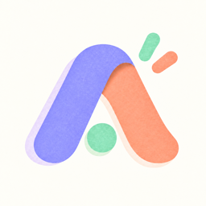
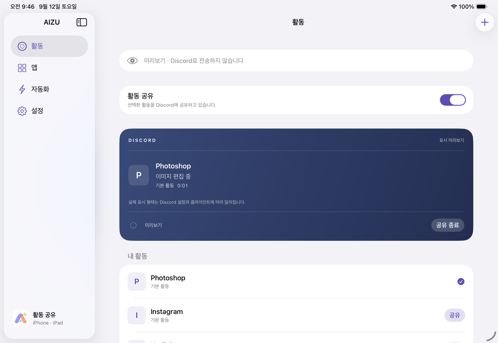
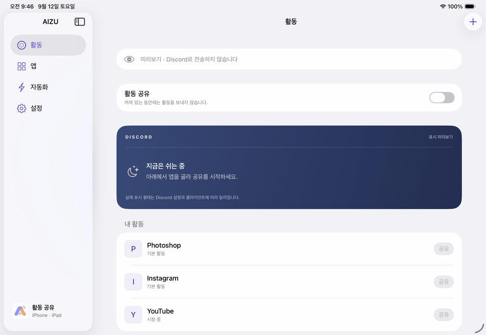
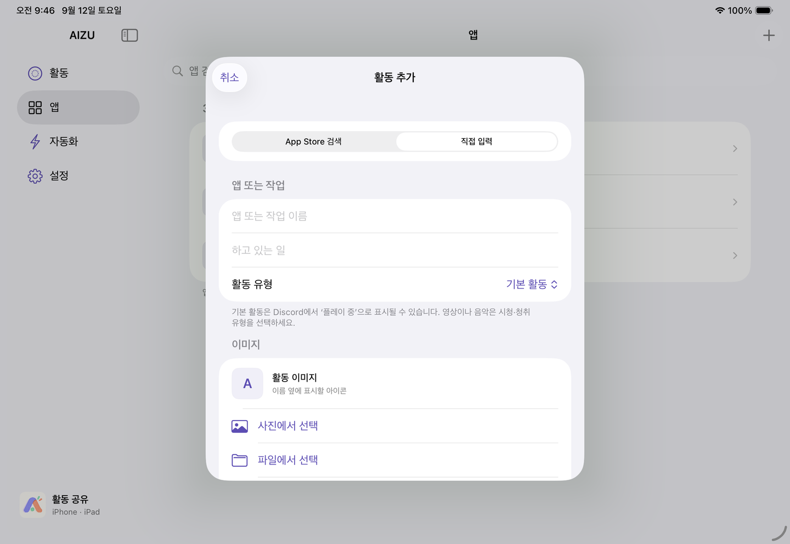
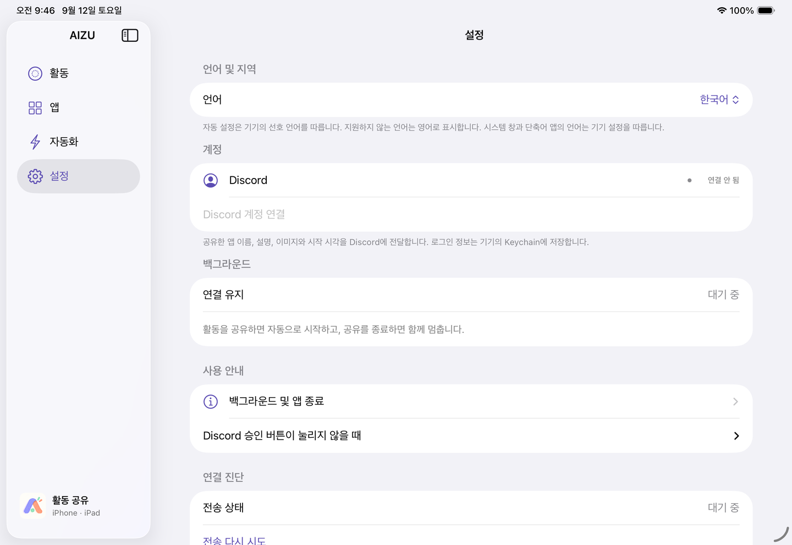

<p align="center"></p>
<h1 align="center">AIZU</h1>
<p align="center">iPhoneやiPadで選んだアクティビティを、Discordに。</p>
<p align="center"><strong>0.1.0 Beta</strong> · SwiftUI · iOS / iPadOS 17+ · MIT</p>
<p align="center"><a href="../README.md">한국어</a> · <a href="README.en.md">English</a> · <strong>日本語</strong> · <a href="README.zh-CN.md">简体中文</a></p>

AIZUは、アプリや作業をDiscord Rich Presenceで共有するiPhone・iPadアプリです。ゲームだけでなく、画像編集、動画視聴、自分で名前を付けた作業も登録できます。共有する内容と開始・終了のタイミングは、自分で選びます。

現在は、**ソースからビルドして個人の端末にインストールするベータ版**です。共有中のバックグラウンド接続を無音オーディオで維持するため、App Store向けには提供していません。AIZUを強制終了した後の接続維持にも対応していません。



## 主な機能

- **アプリと作業の登録**：App Storeで検索するか、手動でアクティビティを追加できます。
- **表示内容の設定**：名前、説明、種類、経過時間、画像を指定できます。端末から選んだ画像はローカルに保存されます。Discordにも表示するには、別途公開HTTPS画像URLが必要です。
- **共有後にアプリを起動**：アクティビティの送信成功後に、アプリURLや指定したショートカットを開きます。
- **ショートカット連携**：対象アプリを開いたとき・閉じたときに、共有を開始・終了するオートメーションを設定できます。
- **共有状況の確認**：カード上でプレビューと送信状態を確認し、再試行や共有終了を操作できます。
- **4言語に対応**：韓国語、英語、日本語、簡体字中国語をサポートします。端末の優先言語に従って選択され、設定画面でも変更できます。

## 使い方

1. 設定でDiscordアカウントを連携します。
2. **+** ボタンからアプリや作業を登録します。
3. **アクティビティ共有**をオンにして、対象の**共有**を押します。
4. 作業が終わったらカードの**共有を停止**を押します。共有をオフにした場合も、現在のアクティビティは終了します。



*画像はiPadシミュレータで撮影した実際の画面です。UI言語は韓国語です。GIFは待機・共有・終了の各画面を順番に表示します。アカウントやDiscordへの通信を使わないプレビューモードであり、他のDiscordクライアントでの表示を撮影したものではありません。*

共有後にアプリを開くには、アクティビティ設定でアプリURLまたはショートカット名を指定します。インストール済みアプリや起動URLは自動検出しません。アプリの開閉に連動するオートメーションについては、[開発ガイド](DEVELOPMENT.md)を参照してください。

| 手動で登録 | 言語と接続の設定 |
| --- | --- |
|  |  |

## ビルド

macOS、iOSシミュレータのランタイムを含むXcode 27ベータ、[XcodeGen](https://github.com/yonaskolb/XcodeGen)が必要です。実機へのインストールにはAppleの開発用署名も必要です。最小デプロイ対象はiOS/iPadOS 17.0ですが、iOS 17実機での動作は未検証です。

```sh
git clone https://github.com/aizuproject/AIZU.git
cd AIZU
brew install xcodegen
export DEVELOPER_DIR=/Applications/Xcode-beta.app/Contents/Developer
AIZU_WITHOUT_SDK=1 zsh scripts/generate.sh
open iPadPresence.xcodeproj
```

`iPadPresence`スキームとシミュレータを選択します。Xcodeプロジェクトは生成物のため、リポジトリには含めません。UIを確認する場合は、Debugスキームの起動引数に`--uitesting --ui-language ja`を追加してください。このモードはメモリ上のサンプルデータを使用し、保存済みアカウントの読み込みやDiscordへの送信は行いません。

実際のDiscord接続には、自分のDiscord Application IDと公式Social SDKが必要です。[接続設定](DEVELOPMENT.md)を完了してから、プロジェクトを再生成してください。SDKバイナリや認証情報はリポジトリに含まれていません。

## バックグラウンド動作と制限

無音オーディオは共有と同時に開始し、共有の終了と同時に停止します。他の音楽アプリ、通話、音声出力先の変更、ネットワーク状況などによって中断される場合があります。追加の電力を消費しますが、バッテリー使用量の定量測定はまだ行っていません。

| 状況 | 現在の動作 |
| --- | --- |
| ホーム画面への移動、アプリの切り替え、画面ロック | オーディオの実行が許可されている間、接続の維持を試みます。 |
| アクセスガイド | 一部の実機で動作を確認しています。すべての端末・アプリでの継続動作は保証しません。 |
| AIZUの強制終了 | 接続を維持できません。 |
| アプリを閉じた際のオートメーションが届かない | 共有が残る場合があります。AIZUで手動終了してください。 |

「Discordに送信済み」はSDKが成功を返したことを示し、相手の画面での表示を確認したことを意味しません。アクティビティはAIZUのDiscordアプリケーションを通じて送信され、選んだアプリの公式連携になるわけではありません。AIZUはDiscordやAppleの公式製品ではありません。

無音オーディオでバックグラウンド実行時間を確保する現在の設計は、App Store配布には適していません。[Appleの審査ガイドライン2.5.4](https://developer.apple.com/app-store/review/guidelines/#software-requirements)も参照してください。

## プライバシーとセキュリティ

選択したアクティビティの名前、説明、画像URL、開始時刻をDiscordに送信します。App Storeの検索語はAppleに送られ、リモート画像の表示時には画像のホストに接続します。認証情報は端末のKeychainに保存します。AIZU独自の情報収集サーバーや解析サービスはありません。

他のアプリの画面、文書、動画タイトルは読み取りません。VPN、位置情報、マイクの権限も使用しません。アクティビティは手動操作または自分で設定したショートカットから開始します。脆弱性は公開イシューではなく、[非公開の報告窓口](https://github.com/aizuproject/AIZU/security/advisories/new)をご利用ください。[セキュリティポリシー](../SECURITY.md)もご確認ください。

## 開発への参加

不具合は再現手順と端末・OS・AIZUのバージョンを添えて、[イシュー](https://github.com/aizuproject/AIZU/issues/new/choose)で報告してください。変更は作業ブランチからプルリクエストで提出します。[貢献ガイド](../CONTRIBUTING.md)、[検証範囲](TESTING.md)、[変更履歴](../CHANGELOG.md)を参照してください。

CIはDiscord SDKや認証情報を使わず、リポジトリの検査とシミュレータテストを実行する構成です。CodeQLの対象はPythonツールとGitHub Actionsです。Swiftコードのセキュリティレビューや実機検証を代替するものではありません。

## ライセンス

AIZUのソースは[MITライセンス](../LICENSE)で公開します。Discord Social SDKは別途ダウンロードが必要で、Discordの利用規約とライセンスに従います。[外部コンポーネントについて](../THIRD_PARTY_NOTICES.md)をご確認ください。
